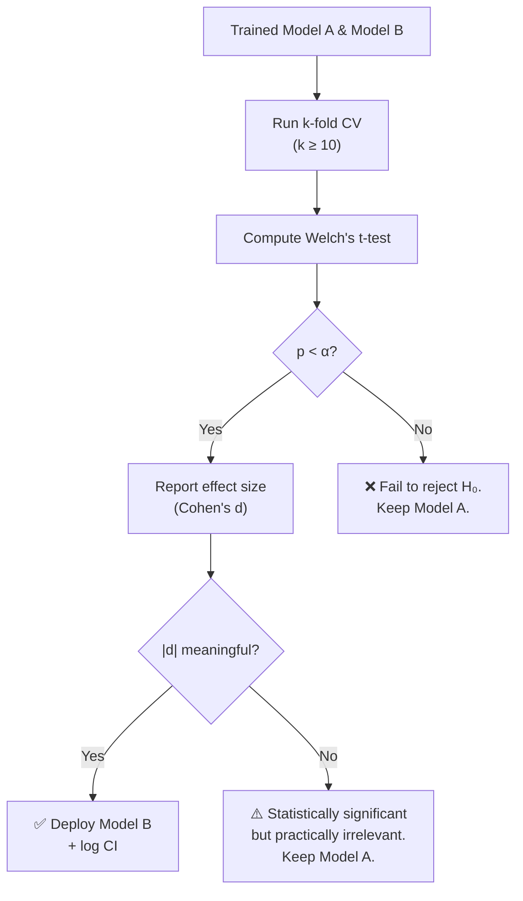

# Statistical Significance & Hypothesis Testing in ML Pipelines

<span class="pow-badge">Month 1 · Module 0 · Lesson 01</span>

---

## 1. The Problem This Solves

You trained two models. Model B has an accuracy of 91.3%; Model A has 90.8%. Your manager asks:

> "Is B actually better, or did we get lucky on the test split?"

If you cannot answer that question **with a number and a confidence level**, you are not doing science — you are doing astrology. This lesson gives you the tools to answer rigorously.

---

## 2. Core Concepts — Mathematical Intuition

### 2.1 The Null Hypothesis ($H_0$)

The **null hypothesis** is the conservative stance: *"There is no real difference between Model A and Model B. Any observed difference is due to random sampling."*

$$
H_0: \mu_A = \mu_B \quad \text{(no difference in population means)}
$$

$$
H_1: \mu_A \neq \mu_B \quad \text{(there IS a real difference)}
$$

!!! info "Why default to $H_0$?"

    In production ML, **false positives are expensive**. Deploying Model B when it isn't actually better means wasted compute, potential regressions, and eroded stakeholder trust. The null hypothesis forces you to prove improvement beyond reasonable doubt.

### 2.2 The T-Statistic

The **T-statistic** measures how many standard errors the observed difference is away from zero (the null). The larger the $|t|$, the less plausible $H_0$ becomes.

For two independent samples with unequal variances (**Welch's T-test**):

$$
t = \frac{\bar{X}_A - \bar{X}_B}{\sqrt{\frac{s_A^2}{n_A} + \frac{s_B^2}{n_B}}}
$$

Where:

| Symbol | Meaning |
|--------|---------|
| $\bar{X}_A, \bar{X}_B$ | Sample means (e.g., mean accuracy across $k$-fold runs) |
| $s_A^2, s_B^2$ | Sample variances |
| $n_A, n_B$ | Number of observations (e.g., number of folds) |

!!! tip "Intuition Check"

    The numerator is the **signal** (observed difference). The denominator is the **noise** (pooled uncertainty). A large $t$ means signal >> noise.

### 2.3 The P-Value

The **P-value** is the probability of observing a test statistic **at least as extreme** as the one computed, assuming $H_0$ is true.

$$
p = P\!\left(|T| \geq |t_{\text{obs}}| \;\middle|\; H_0\right)
$$

!!! danger "What the P-value is NOT"

    - It is **not** the probability that $H_0$ is true.
    - It is **not** the probability that you made an error.
    - It **is** a measure of *surprise*: "If there were truly no difference, how unlikely is this data?"

**Decision rule at significance level $\alpha$:**

$$
\text{Reject } H_0 \iff p < \alpha
$$

Convention: $\alpha = 0.05$ (5% false positive rate). In high-stakes ML (medical, financial), use $\alpha = 0.01$.

### 2.4 Degrees of Freedom (Welch-Satterthwaite)

For Welch's T-test, degrees of freedom are approximated:

$$
\nu \approx \frac{\left(\frac{s_A^2}{n_A} + \frac{s_B^2}{n_B}\right)^2}{\frac{\left(\frac{s_A^2}{n_A}\right)^2}{n_A - 1} + \frac{\left(\frac{s_B^2}{n_B}\right)^2}{n_B - 1}}
$$

You rarely compute this by hand — `scipy.stats.ttest_ind` does it for you — but understanding it matters when $n_A \neq n_B$.

---

## 3. The "So What?" — Why Data Scientists Need This

### 3.1 A/B Testing in Production

Every tech company runs A/B tests: new recommendation model vs. old, new ranking algorithm vs. baseline. Without hypothesis testing:

- You deploy based on **anecdote** ("the click rate looked higher last Tuesday").
- You cannot compute **required sample size** before launch.
- You risk **peeking** at results too early and making premature decisions.

!!! example "Real-World Scenario"

    Your e-commerce team wants to test a new product ranking model. With hypothesis testing, you can answer:

    1. **Before launch:** "We need 10,000 sessions per variant to detect a 2% lift at $\alpha=0.05$, power $= 0.8$." (power analysis)
    2. **After collection:** "The p-value is 0.003. We reject $H_0$ — the new model's conversion rate is statistically significantly higher."
    3. **Confidence interval:** "The true lift is between 1.2% and 3.1% (95% CI)."

### 3.2 Model Comparison in ML Pipelines

=== "The Wrong Way"

    ```
    Model A accuracy: 90.8%
    Model B accuracy: 91.3%
    → Ship Model B ✓
    ```

    This compares **single point estimates** with zero uncertainty quantification.

=== "The Right Way"

    ```
    Model A (10-fold CV): 90.8% ± 1.2%
    Model B (10-fold CV): 91.3% ± 1.4%
    Welch's t-test p-value: 0.23
    → FAIL to reject H₀. Difference is NOT significant.
    → Keep Model A (simpler, already deployed).
    ```

    This is what a **job-ready** data scientist does.

### 3.3 Guarding Against Common Pitfalls

| Pitfall | What Goes Wrong | The Fix |
|---------|----------------|---------|
| **Multiple comparisons** | Testing 20 models → ~1 will "win" by chance at $\alpha = 0.05$ | Bonferroni correction: $\alpha' = \alpha / m$ |
| **Peeking** | Checking p-value daily until it's significant | Pre-register sample size; use sequential testing |
| **Small $n$** | 3-fold CV gives you $n=3$ — huge variance | Use 10-fold or repeated stratified k-fold |
| **Ignoring effect size** | $p = 0.001$ but lift is 0.01% — who cares? | Always report **Cohen's d** alongside $p$ |

---

## 4. Implementation Lab — Comparing Two Model Versions

### 4.1 Setup

```python
# requirements: scipy, numpy, scikit-learn
import numpy as np
from scipy import stats
from sklearn.model_selection import cross_val_score
from sklearn.datasets import load_breast_cancer
from sklearn.linear_model import LogisticRegression
from sklearn.ensemble import RandomForestClassifier
```

### 4.2 Collect Cross-Validation Scores

```python
# Load dataset
X, y = load_breast_cancer(return_X_y=True)

# Model A: Logistic Regression (baseline)
model_a = LogisticRegression(max_iter=10_000, random_state=42)
scores_a = cross_val_score(model_a, X, y, cv=10, scoring="accuracy")

# Model B: Random Forest (challenger)
model_b = RandomForestClassifier(n_estimators=100, random_state=42)
scores_b = cross_val_score(model_b, X, y, cv=10, scoring="accuracy")

print(f"Model A — Mean: {scores_a.mean():.4f}, Std: {scores_a.std():.4f}")
print(f"Model B — Mean: {scores_b.mean():.4f}, Std: {scores_b.std():.4f}")
```

### 4.3 Welch's T-Test

```python
# Welch's t-test (does NOT assume equal variances) # (1)!
t_stat, p_value = stats.ttest_ind(scores_a, scores_b, equal_var=False)

alpha = 0.05

print(f"\n--- Hypothesis Test Results ---")
print(f"T-statistic:  {t_stat:.4f}")
print(f"P-value:      {p_value:.4f}")
print(f"Alpha:        {alpha}")
print(f"Significant:  {'YES — reject H₀' if p_value < alpha else 'NO — fail to reject H₀'}")
```

1. Setting `equal_var=False` switches from Student's t-test to **Welch's t-test** — always safer when you can't guarantee both models have the same variance across folds.

### 4.4 Effect Size (Cohen's d)

```python
def cohens_d(group1: np.ndarray, group2: np.ndarray) -> float: # (1)!
    """Compute Cohen's d for independent samples."""
    n1, n2 = len(group1), len(group2)
    pooled_std = np.sqrt(
        ((n1 - 1) * group1.std(ddof=1)**2 + (n2 - 1) * group2.std(ddof=1)**2)
        / (n1 + n2 - 2)
    )
    return (group1.mean() - group2.mean()) / pooled_std

d = cohens_d(scores_a, scores_b)
print(f"Cohen's d:    {d:.4f}")
print(f"Effect size:  {'Small' if abs(d) < 0.5 else 'Medium' if abs(d) < 0.8 else 'Large'}")
```

1.  Cohen's d thresholds: **Small** ($|d| < 0.5$), **Medium** ($0.5 \leq |d| < 0.8$), **Large** ($|d| \geq 0.8$).

### 4.5 Confidence Interval for the Difference in Means

```python
diff = scores_a.mean() - scores_b.mean()
se_diff = np.sqrt(scores_a.var(ddof=1)/len(scores_a) + scores_b.var(ddof=1)/len(scores_b))

# 95% CI using t-distribution
df = len(scores_a) + len(scores_b) - 2  # approximate
t_crit = stats.t.ppf(1 - alpha/2, df)

ci_lower = diff - t_crit * se_diff
ci_upper = diff + t_crit * se_diff

print(f"\n95% CI for (μ_A - μ_B): [{ci_lower:.4f}, {ci_upper:.4f}]")
print("→ If CI contains 0, the difference is not significant.")
```

---

## 5. Decision Framework — Putting It All Together



!!! success "The Golden Rule"

    **Statistical significance without practical significance is noise.** Always pair the p-value with effect size and a confidence interval. Your stakeholders don't care about p-values — they care about *"how much better, and how sure are you?"*

---

## 6. Key Takeaways

| Concept | One-Liner |
|---------|-----------|
| $H_0$ | "There is no difference" — your default until proven otherwise |
| T-statistic | Signal-to-noise ratio of the observed difference |
| P-value | How surprised you should be if $H_0$ were true |
| $\alpha$ | Your tolerance for false positives (typically 0.05) |
| Cohen's d | The **magnitude** of the difference (small / medium / large) |
| Confidence Interval | The plausible range of the true difference |

---

## Next Steps

:material-arrow-right: **[Implementation Lab: Statistical Validator](lab_statistical_validator.md)** — Package this into a reusable class.

:material-arrow-right: **[Proof of Work](proof_of_work.md)** — The challenge you must commit to GitHub.
